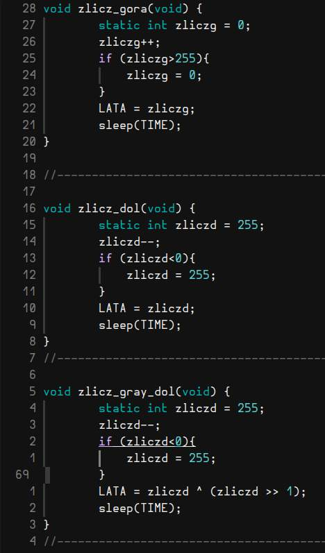

# Marcin Głód 164004
# Systemy Wbudowane - Sprawozdanie.

## cel:
- zapozanie z działaniem mikrokontrolera
- poznanie procesu prototypowania systemów opartych o mikrokontrolery
- zaznajomienie z procesem debugowania oprogramowania mikrokontrolerów
- podstawy tworzenia oprogramowania w oparciu o płytki rozwojowe

---

## Opis Środowiska pracy
- mplab X IDE 
  (+ neovim, git bo w tym szajsie się nie da pisać)
- explorer 16/32 
  funkcje, przeznaczenie, zastosowanie, moduły, kompatybilne procesory
- procesor PIC24FJ128GA010 
  taktowanie, ram, parametry, zastosowanie IRL

---

## opis zrealizowanych zadań

### liczniki binarne

Program przygotowany w tym zadaniu zajmuje się wyświetlaniem kolejnych liczb przy użyciu diod dostępnych na płytce. Naciśnięcie przycisków S3 oraz S4 powoduje zmianę systemu binarnego w jakim wyświetlane są liczby. Dostępnymi trybami są:

- licznik binarny zliczający w górę
- licznik binarny zliczający w dół
- licznik w kodzie Graya zliczający w górę
- licznik w kodzie Graya zliczający w dół
- dwucyfrowy licznik BCD zliczający w górę
- dwucyfrowy licznik BCD zliczający w dół

Poniżej możemy się przyjrzeć implementacji zastosowanych funkcji zliczających:

### potencjometr
### mikrofalówka
### zegar szachowy

---

## problemy i trudności

- mplab działa jak kupa na linuxie
- instalacja z ważącego 900MB .sh to jakiś żart w standardzie bezpieczeństwa
- niszowa, droga i niedostępna platforma (w czasie gdy ATmega328, ESP32 lub PIC16F877A oferują praktycznie to samo, ale za to student jest w stanie je kupić i podłubać coś w domu)
- 

---

## Źródła:

- dokumentacja od microchip
- 
